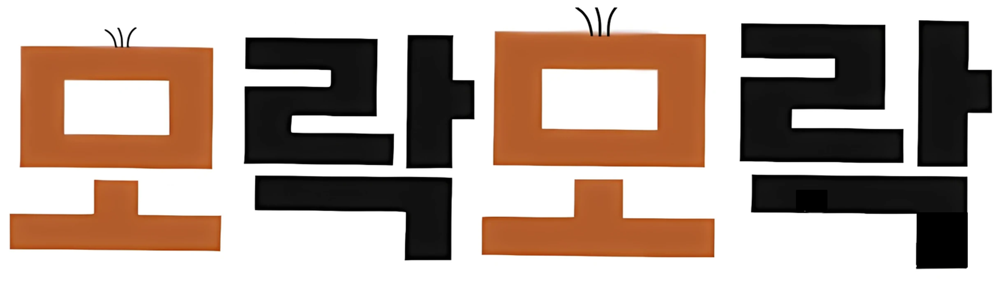
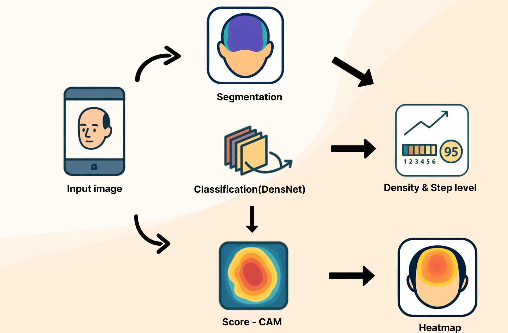
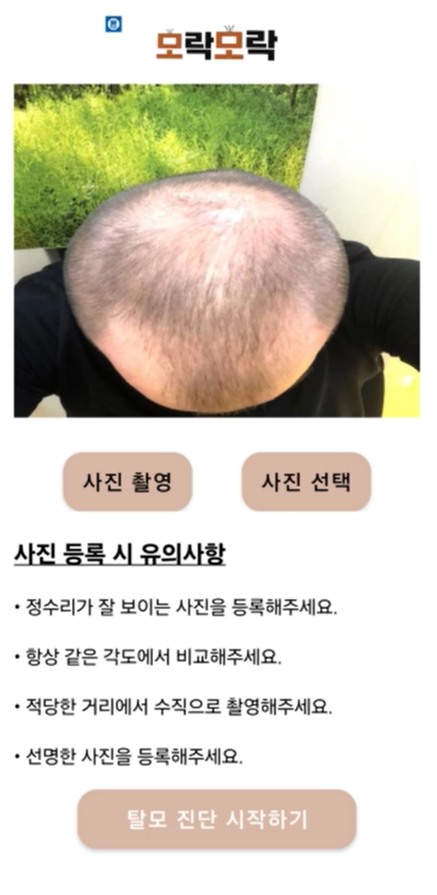
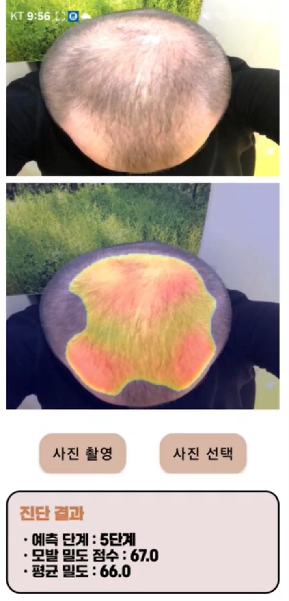
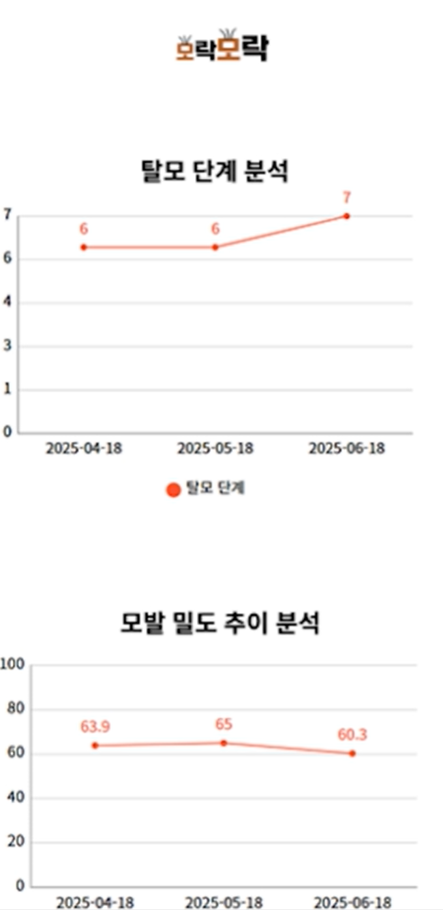

# 2025 hallym-capstone_design
2025 한림대학교 정보과학대학 캡스톤 디자인

 
팀명: 딸깍 
팀원: 20202701 강민선(팀장), 20195195 안정우, 20182428 유현우 
주제: Vision-AI 기반 탈모진단 서비스(모락모락) 

사용한 학습 데이터 
**classification - https://universe.roboflow.com/onuralpszr/hair_norwood_hamilton **
**segmentation - https://universe.roboflow.com/tangoku/hairloss-segmentation/dataset/2 **

주제 개요 
1.해밀턴-노우드 척도를 기반으로 탈모 단계를 1~7단계로 구분한 데이터를 가지고 CNN기반 model을 통해 탈모 단계를 분류 
2.Segmentation을 통해 이미지에서 모발과 두피 영역을 분리, 이를 토대로 모발의 밀도 점수를 계산 
3. 학습된 CNN기반 model으로 CAM을 사용, CAM을 통해 두피를 강조한 heatmap 생성 
4. 어플리케이션을 개발, 서버에 이미지를 보내면, 모델을 통해 추론을 진행 한 뒤 어플리케이션에 결과를 출력 

 

**어플리케이션 결과**

